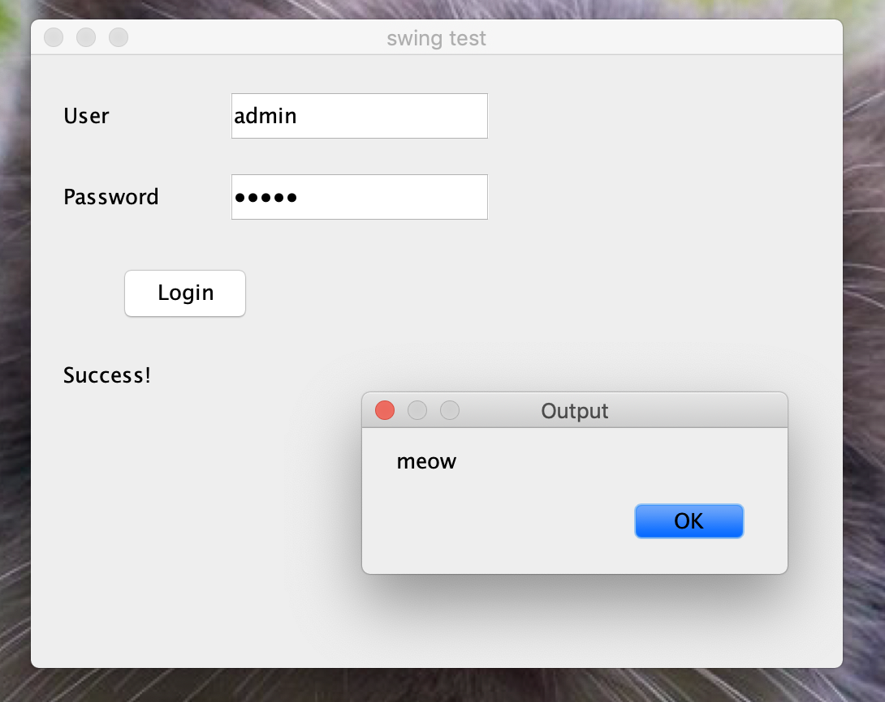

# Login GUI
Opens a new window if the password and login are entered correctly.

Correct password and login: ``admin/admin``
###Executing
``javac GUI.java && java GUI``

###References
[video](https://www.youtube.com/watch?v=iE8tZ0hn2Ws)

[swing documentation](https://docs.oracle.com/javase/7/docs/api/javax/swing/package-summary.html)

What it looks like:
